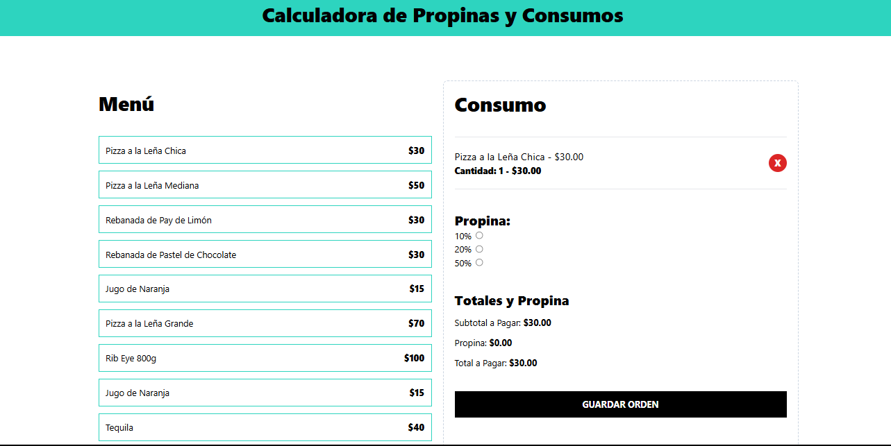

# Calculadora de Propinas y Consumo

Este proyecto es una aplicación web desarrollada completamente con **TypeScript** que permite calcular el consumo y las propinas en un restaurante de forma interactiva y práctica. Para el diseño se utilizó React más el framework Tailwind CSS. Es ideal para practicar conceptos avanzados como **State Management**, **Custom Hooks**, y la organización de archivos en TypeScript.

## Demo 🚀

<a href="https://gregarious-mermaid-c5c8ea.netlify.app/" target="_blank">Prueba la calculadora en vivo aquí</a> 

## Screenshots

## Main Features ✨

- **Gestión de consumo interactiva**: Visualiza un menú con artículos y precios. Agrega artículos al consumo con un solo clic. Modifica el consumo eliminando artículos fácilmente.
- **Cálculo de propinas en tiempo real**: Ajusta el porcentaje de propina (10%, 20%, 50%). Observa cómo el subtotal, la propina y el total a pagar se actualizan dinámicamente.
- **Control interno de órdenes**: Almacena simuladamente las órdenes con un botón de "Guardar orden". Restaura el sistema para ingresar nuevos consumos.

## What I learned with this project 📚
### Technologies used: 

**Client:** React, TailwindCSS

**Server:** TypeScript, Vite, Custom Hooks, State Management

### Application optimization:

- Creación de un Custom Hook (useTipCalculator) para encapsular la lógica del cálculo de propinas.
- Uso de useMemo y useCallback para optimizar el rendimiento evitando renderizados innecesarios: 

   * useMemo: Memoriza valores derivados de cálculos complejos, mejorando el rendimiento.
   * useCallback: Memoriza funciones para evitar que cambien innecesariamente entre renderizados.

### Focus on best practices:

- Implementación modular y reutilizable de componentes.
- Aplicación de principios de State Management para controlar el estado de consumo y propinas de forma eficiente.

